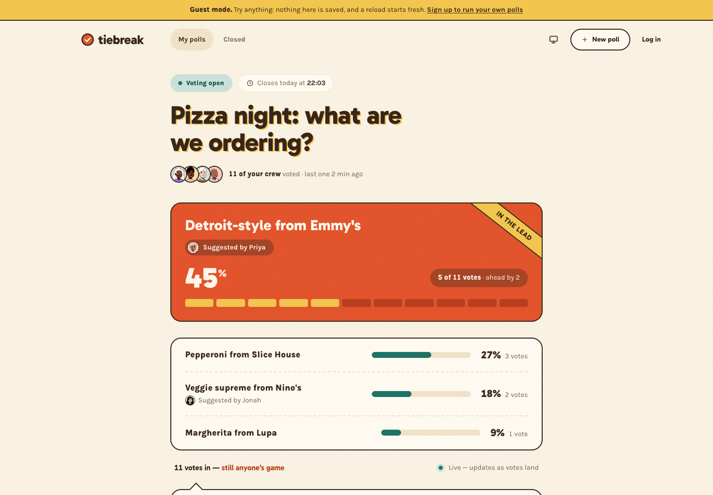

# Tiebreak — Sarah Abuteen

Group-decision polls that live in the group chat: voters need no account, results stay honest at small numbers, and the close ends with a reveal worth screenshotting.

**Challenge:** [Tiebreak on Frontend Mentor](https://www.frontendmentor.io/challenges/poll-creator-app)

**Live URL:** [poll-creator-app.vercel.app](https://poll-creator-app.vercel.app/)



---

## Overview

A full-stack build: creators sign up, make a poll in under a minute and paste a link into the chat. Voters open it on their phones, type a name, pick a face and vote. They can suggest options the organiser didn't think of, and the organiser adds or declines them. Results update live while voting is open, and when it closes (on time, or early) the result is revealed with who backed what.

**What's in it**

- **Creator accounts** with email and password; creator pages and APIs are protected, vote links never are.
- **Dashboard** that features the poll closing soonest, counts waiting suggestions, and has a designed first run.
- **Poll creation** (2–10 options, single vote or pick-up-to-N, suggestions on/off, one-tap closing times) landing on a share step.
- **The vote page**: name, preset face and tint, an unselected ballot, a "no takebacks" confirmation, and distinct states for just voted, returning and closed.
- **Suggestions and moderation** with "Add it" (joins with 0 votes), "Not this time", and undo.
- **Live results**: a per-voter tally for the leader, pack bars relative to the leader, counts beside every percentage, ties in words, throttled screen-reader updates.
- **Closing and the reveal**: auto-close at the deadline, End voting, Reopen voting with a new closing time, Copy result, and a designed tie.
- **Guest mode** at `/guest`: the real organiser screens over the sample polls, fully interactive, nothing saved.
- **Dark mode**, designed 404 and error pages, empty states and loading skeletons.
- WCAG 2.2 AA throughout, checked by an automated browser suite in both themes.

Under the hood, every poll rule is a pure function in [`src/domain/rules.ts`](src/domain/rules.ts) (settling at the deadline, ending and reopening, validating a ballot, moderating suggestions, the undo window), shared by the server and guest mode. Writes run in transactions that lock the poll row, and one ballot per browser is a unique constraint in the database. Pages only read data through the app's own HTTP API; an ESLint rule forbids importing the database layer anywhere else. While a poll is open, no API response links a voter to an option.

### Tech Stack

| Layer | Technology |
|-------|-----------|
| Framework | Next.js 16 (App Router) with React 19 and TypeScript |
| Database | Postgres on Neon, through Drizzle ORM; embedded PGlite for local development and tests |
| Authentication | Better Auth (email and password), sessions stored in Postgres |
| Live updates | Polling every 4s with ETags, so unchanged polls answer 304 |
| Avatars | DiceBear "micah" rendered locally with `@dicebear/core`, served from `/api/avatars` |
| Hosting | Vercel |
| Styling | Tailwind CSS 4 over the brand-kit design tokens |
| Other | Zod for validation; Vitest (unit, API, real Postgres) and Playwright with axe-core for testing; Drizzle migrations |

**Why this stack:** Next.js puts the public vote page, the creator screens and the API in one deployable app, with server rendering for a fast first load on phones. Neon gives a free hosted Postgres that suits serverless functions. Drizzle keeps SQL visible and typed, which matters for a state machine enforced in the database. Better Auth stores users and sessions in that same database instead of adding another service. PGlite runs a real Postgres in-process, so local development and CI need no Docker or secrets.

---

## Design Decisions

### The Voter's Side of the Story

**The problem I was solving:** a voter's story doesn't end at "Cast my vote". They need to know it counted, a return visit must not look like a second ballot, and a latecomer who taps an old link needs a result, not an error. All three share one URL.

**My approach:**

- **Just voted:** "Counted, Priya!" with their own face popping in, "You backed Veggie supreme", "No takebacks: your vote is locked in", the faces of who else has voted, and when the result lands ("The result lands here when voting closes today at 7:00 PM"). Focus moves to the confirmation so it's read out.
- **Returning:** the same screen at rest ("You're in, Priya"), announced as "You've already voted in this poll". Their face is remembered in the browser; the server knows their ballot from an httpOnly cookie.
- **Latecomer:** the settled result, stated plainly ("The organiser ended voting on Friday"), with the winner, the standings and who backed what. No apology and no ballot.
- **No live race for voters.** Voters see who has voted but not the counts until the close.

**Why I chose this approach:** seeing the race before the close invites tactical voting from whoever votes last, and it spends the reveal early. Keeping the voter's own choice visible in every state answers the one thing they come back to check. The three states use different headings, page titles and announcements, so nobody mistakes a closed poll for an open ballot.

**What I'd do differently:** offer a "remind me when it closes" option, so voters don't have to come back to find out.

### The Reveal

**The problem I was solving:** closing a poll is the payoff. It has to communicate the result, credit the crew, read correctly in a chat screenshot, work without motion, and handle a tie.

**My approach:**

- **Winner:** "The crew picked" over the winner in large type, the percentage counting up, tally ticks stamping in one by one, a butter "Winner" ribbon swinging in, the backers' faces popping in, and paper confetti. The count always sits beside the percentage ("5 of 11 votes · ahead by 2").
- **Plays once.** The full reveal plays the first time each browser sees a result; every later visit shows the same screen at rest. Reopening and closing again counts as a new result.
- **Reduced motion:** nothing moves and no confetti is created. The butter ribbon, large type and the words carry the occasion, and the outcome is announced once to screen readers either way.
- **Tie as unfinished business:** "It's a tie!" with the tied options side by side as equals, each with its backers. The organiser gets "Break the tie: reopen voting"; voters see "Nobody wins yet. The organiser can reopen voting to settle it."
- **Copy result** (distinct from Copy link, which copies only the URL):

  ```
  Pizza night: what are we ordering?
  The crew picked Detroit-style from Emmy's
  5 of 11 votes (45%), ahead by 2

  1. Detroit-style from Emmy's — 5 votes (45%)
  2. Pepperoni from Slice House — 3 votes (27%)
  3. Veggie supreme from Nino's — 2 votes (18%)
  4. Margherita from Lupa — 1 vote (9%)

  Backed by Priya, Ada, Kai + 2 more
  Full result: https://…/p/pizza-night
  ```

**Why I chose this approach:** the live screen stays calm so the close can be loud, and the brand kit reserves butter and tangerine for exactly this moment. Tallies and counts keep it honest at 11 votes. A tie can't crown a winner, so the screen says so and points at the way to settle it.

**What I'd do differently:** build the "sudden death" differentiator, a quick revote between only the tied options, instead of reopening the whole poll.

### First Run

**The problem I was solving:** a brand-new organiser on an empty dashboard, and the path from zero to a link sitting in the group chat.

**My approach:**

- **Empty dashboard:** "Settle your first group decision", a single tangerine New poll button (the one place the brand kit allows a filled tangerine New poll), three short steps (make it, drop the link in the chat, watch it settle), and a dashed outline of a poll with no invented numbers.
- **Creating a poll:** one-tap closing times in the organiser's own timezone ("Tonight at 9:00 PM", "Tomorrow at 12:00", "In 3 days"), with a custom date and time as a fallback and the resolved time always spelled out.
- **Dedicated share step:** "Your poll is ready", the link truncated with Copy link and the phone's native Share, and a preview of how the message will read in the chat.
- **Dashboard after one poll:** the new poll is featured as closing soonest. With zero votes it reads "No votes yet. The link works, so drop it in the group chat and the race starts here" instead of an empty race.

**Why I chose this approach:** the moment that matters is the link landing in the chat, so every first-run element points at it. Guest mode carries the "what does this look like full" story, so the empty state doesn't have to explain everything.

**What I'd do differently:** add "Quick starts" (templates like Film night or Takeaway) so the first poll is one tap more.

### Product Rules I Decided

| Rule | What I chose | Why |
|------|--------------|-----|
| Reopening a poll | Always asks for a new closing time, 5 minutes to 30 days away, in a confirmation dialog | The old deadline has usually passed, and "open until ended" would never settle on its own |
| Closing | A poll counts as settled once its deadline passes, worked out when it's read; no scheduled job | Polls settle even if nobody has the page open, with nothing to keep running |
| One vote per person | One ballot per browser: an httpOnly cookie token plus a unique constraint in the database. Casting is idempotent per ballot id, so a double tap or retry counts once | Casual, not forensic. A friend using two browsers is acceptable; a refresh double-counting is not |
| Votes | Final. There is no change-vote or un-vote in the UI or the API | "No takebacks" is a product rule; a hidden loophole would make the confirmation a lie |
| Access control | Vote and result pages are public to anyone with the link; the poll's slug has 80 random bits | The link is the access control. Creator pages and APIs require a session, and another creator's poll looks like a 404 |
| Attribution | Who voted for what is revealed only once a poll has settled, enforced by the API | Knowing who backed what while voting is open changes how people vote |
| More than 20 voters | The leader's one-tick-per-vote tally becomes a proportional bar | Past about 20, individual ticks stop reading as a scoreboard |
| Declined suggestions | Recoverable with Undo for 10 minutes. An approved suggestion can only be pulled back while nobody has voted for it | Declining a named friend's idea deserves an undo; votes are final |
| Moderation after close | Locked: the ballot can't change once voting has ended | The result has to describe the ballot people actually voted on |
| Suggestion limits | 3 pending per voter and 10 per poll | Keeps the organiser's queue manageable; decided suggestions don't count |
| Abuse | Rate limits on voting and suggesting per browser and per IP, stored in Postgres with IPs only as salted hashes | Generous enough for a group on one Wi-Fi, strict enough to stop floods |

### Other Design Choices

- **Avatars:** eight preset DiceBear faces plus the four brand tints, as proper radio groups. The preview is exactly the saved avatar, and a failed image falls back to a tinted circle.
- **Moderation copy:** "Add it" / "Not this time", with "joins with 0 votes" stated where the organiser decides and where the option appears.
- **Cast my vote** is `aria-disabled` rather than disabled until there's a name and a choice, so it stays focusable and can explain what's missing.
- **Errors never use tangerine or butter** (they mean winning). Errors are cocoa text, an icon and plain words, and failures keep what the voter entered.
- **Dark mode** is a lamplit deep-cocoa version with the same color roles, following the system setting or the header toggle. Every color pair in both themes is checked by [`scripts/check-contrast.mjs`](scripts/check-contrast.mjs).
- **Guest mode** runs the real screens and the real rules engine in the browser over the sample polls, with timestamps shifted to the moment you open it, so pizza night always "closes today".
- **Search and link previews:** vote links are `noindex` (they're private to whoever has them), but they unfurl in the chat with the poll's title, a description that follows the attribution rule (no counts while voting is open, the result once settled) and a branded preview image. The public pages (`/guest`, `/signup`, `/login`) have canonical URLs and are listed in `sitemap.xml`; `robots.txt` keeps crawlers out of the API and creator screens.
- **Status screens:** designed 404s that are never a dead end, an error page with a retry, empty states that say what will appear, and loading skeletons shaped like the page that's coming.

---

## Development Journey

### Initial Approach vs. Final

The plan was a scope-by-scope build, with each scope's frontend first and its backend second: foundations and database, the rules engine and API, accounts, live results, the vote page, creation and dashboard, the reveal, guest mode, then an accessibility and performance pass. The main change along the way was architectural: pages first read the database directly, and were moved behind the HTTP API with a lint rule to keep it that way.

### Decisions Reconsidered

- **Pages reading the database directly** were replaced by pages that call the app's own API, so every screen goes through the same rules and responses.
- **The theme toggle** first used an inline script to avoid a flash of the wrong theme; it moved to a server-rendered cookie, which removed a React warning and made "no flash" guaranteed.
- **Local tests only on PGlite** missed a bug that only appeared on Neon's driver (see below), so the test suite now also runs against a real Postgres in CI.
- **The header's three-column layout** needed a wider breakpoint once the theme button was added, so it no longer scrolls sideways.

### What Surprised Me

- **Driver differences are real.** The rate limiter passed every test on PGlite but broke every vote on Neon: the Postgres driver can't serialise a JavaScript `Date` inside a raw SQL fragment. Re-running the tests against a real Postgres reproduces it, and CI now does that on every push.
- **Races hide in fast UIs.** Pressing Undo while "Add it" was still in flight could let the two requests cross. Requests about the same suggestion are now sent in order.
- **Large text on phones** broke layouts that looked fine at 320px: fieldsets have a built-in minimum width, and long words don't wrap by default.

### Session Breakdown

| Session | Focus | What I Accomplished |
|---------|-------|-------------------|
| 1 | Setup and the concept screen | Next.js project, brand tokens, the live results screen from `preview.jpg` |
| 2 | Foundations | Drizzle schema, Neon and PGlite, migrations, seeding, CI |
| 3 | Rules engine and API | Pure state machine, transactional commands, attribution-safe views, HTTP API, import boundary |
| 4 | Creator accounts | Log in and sign up screens, Better Auth, protected routes |
| 5 | Live results | Polling with ETags and 304s, wired moderation with undo, throttled announcements |
| 6 | The vote page | Identity picker, ballot, confirmation, voted and latecomer states, suggestions, rate limits, local avatars |
| 7 | Creation and dashboard | Create form, share step, first run, dashboard API |
| 8 | The reveal | End and reopen, winner and tie reveal, Copy result |
| 9 | Guest mode | Sample data API, swappable backend, in-browser rules |
| 10 | Quality pass | axe and Playwright suite, reflow fixes, Lighthouse, real-Postgres tests |
| 11 | Dark mode and status screens | Dark palette, theme toggle, 404 and error pages, empty states, loading skeletons |

---

## AI Collaboration Reflection

<!-- Write this section in your own words. Some prompts from how this build went: -->

### How I Used AI

I built Tiebreak with Claude Code as a pair: I set the plan and the scope order, made the product and design calls when the spec left room (the voter's post-vote experience, the reveal, first run, dark mode), and had AI implement, test and verify each scope in a real browser.

### What Worked Well

- Splitting every scope into frontend first, then backend, so each could be reviewed in isolation.
- Asking for the spec's own words before deciding ("what do the md files say?") so choices were grounded in the brief.
- Requiring verification: tests for every rule, mutation checks that the tests can fail, and screenshots or browser checks for every screen.

### What I Learned

- **Rules belong in one place.** Writing the poll rules as pure functions first made the API, the database transactions and guest mode agree by construction, and made every rule cheap to test.
- **Test against what you ship.** An embedded database is great for speed, but only a real Postgres run caught the bug that broke voting in production.
- **Accessibility is layout work too.** Most of the fixes from the accessibility pass were about reflow at 320px and 200% text, not ARIA.
- **Reviewing AI output means checking behaviour, not just reading code.** The issues that mattered (a failing vote, a wrapping header) showed up by using the app, not by reading the diff.

### Where I Pushed Back

- Required that no page reads the database directly, which led to the API-only architecture and the lint rule that enforces it.
- Reported the vote error on the deployed database, which exposed the driver difference that local tests had missed.
- Spotted header alignment and button wrapping issues by eye that automated checks hadn't flagged.
- Chose not to build a landing page, and to prioritise guest mode and quality work instead.

---

## Differentiators

### Chosen Differentiator(s)

None yet. Time went into guest mode, dark mode, and an accessibility and testing pass instead.

**1. [Differentiator Name]**

**Why I chose this:** The natural next ones are the share card (a poll link that previews as its result inside the chat) and sudden death for ties.

**How it enhances the product:**

**Implementation highlights:**

**What I learned:**

---

## Self-Assessment

Rate your implementation honestly. This self-awareness is part of the portfolio artifact.

| Category | Rating | Notes |
|----------|--------|-------|
| **Works for real users** — Deployed, functional end-to-end; a poll can go from created to decided via a real shared link | 5/5 | Deployed on Vercel with Neon; polls go from created to settled through a real shared link |
| **The vote page** — Phone-first, self-explanatory in seconds, zero friction between link tap and cast vote | 5/5 | Phone-first, sticky cast button, keyboard-only flow tested |
| **Honest results** — Per-voter tally, relative pack bars, counts beside every percentage, ties in words | 5/5 | Per-voter tally, relative bars, counts beside every percentage, ties in words |
| **State machine integrity** — Open/settled/reopened and suggestion states enforced server-side; votes final | 5/5 | Enforced server-side in transactions, with database constraints and tests for every rule |
| **The reveal** — Feels earned, survives a screenshot, works without motion, handles the tie | 4/5 | Once per browser, reduced-motion version, designed tie, Copy result; no share-card image yet |
| **Design quality** — Typography, spacing, visual hierarchy, color roles held, polish | 4/5 | Brand kit roles held, including a matching dark palette |
| **Responsive design** — Fully functional and well-designed from 320px up | 5/5 | Every screen tested at 320px with 100% and 200% text |
| **Performance** — Fast vote page on mobile, snappy casting, live updates without jank | 5/5 | Lighthouse 97 on the deployed vote page; polling answers 304 when nothing changed |
| **Accessibility** — Keyboard end-to-end, announced live results and outcomes, focus management, contrast | 4/5 | Zero axe violations across screens in both themes; screen reader pass still to do |
| **Landing page & guest experience** — Compelling front door; the guest dashboard tells the product's story immediately | 3/5 | No landing page; guest mode is complete |

### Lighthouse Scores

<!-- Run Lighthouse on your deployed site; include the vote page, not just the landing page -->

Vote page (`/p/pizza-night`) on the deployed site, Lighthouse 12 mobile:

| Category | Score |
|----------|-------|
| Performance | 97 |
| Accessibility | 100 |
| Best Practices | 100 |
| SEO | 91 |

The vote page's SEO score misses only the meta description: its metadata depends on the poll, so Next.js streams it after the loading skeleton for browsers, while link-preview bots get it in `<head>`. Vote links are deliberately `noindex`. The public pages (`/guest`, `/login`) score 100 for SEO.

### Strengths

- The rules engine: one set of pure functions enforced in database transactions, shared with guest mode.
- Honest, accessible live results that never steal focus or flood a screen reader.
- The testing: 165 unit and API tests on two databases, plus an end-to-end suite covering accessibility, keyboard use, reflow, reduced motion and dark mode.

### Areas for Improvement

- A landing page as the public front door.
- Real-time push instead of polling.
- A screen reader pass on real devices.

---

## Known Limitations

- **No landing page.** `/` sends signed-out visitors to log in; "Try Tiebreak as a guest" is linked from the log-in and sign-up pages.
- **Not built:** saved voter identity for account holders, and 30-day retention or deleting polls (stretch features 11 and 12).
- **Screen reader testing** has been automated only (axe, focus and announcement checks), not done with VoiceOver, NVDA or TalkBack.
- **Missing-poll pages** on vote links and in guest mode show the designed 404 but answer with status 200 plus `noindex`, because the loading skeleton starts streaming before the poll lookup finishes. Unknown routes and the API return real 404s.
- **Live updates use polling** (every 4 seconds), not push.
- **Log-in rate limiting** from Better Auth counts in memory per server instance.
- **The client IP for rate limits** comes from `x-forwarded-for`, which is trustworthy on Vercel but could be spoofed on a host that passes it through untouched.
- **Guest mode's sample data** includes who voted for what on open polls, so the reveal can play in the browser. Every name there is invented sample data.

---

## Running Locally

```bash
# Clone the repo
git clone https://github.com/sarahabuteen/poll-creator-app.git
cd poll-creator-app

# Install dependencies
npm install

# Set up environment variables
cp .env.example .env.local
# Leave DATABASE_URL unset to use a local embedded Postgres (PGlite),
# or add your Neon connection string and a BETTER_AUTH_SECRET

# Create the tables and load the sample polls
npm run db:setup

# Run the development server
npm run dev

# Tests: unit and API (PGlite), the same against real Postgres, end to end
# (stop the dev server first), and the colour contrast check
npm test
npm run test:postgres
npm run test:e2e
npm run check:contrast
```

Open http://localhost:3000/guest to explore without an account. To log in as the sample creator locally, set `SAMPLE_CREATOR_PASSWORD` before seeding and log in as `morgan@tiebreak.test`.

### Environment Variables

| Variable | Description |
|----------|------------|
| `DATABASE_URL` | Pooled Postgres connection string (Neon). Leave unset locally to use PGlite. Required in production. |
| `BETTER_AUTH_SECRET` | Signs session cookies. Required in production; generate with `openssl rand -base64 32`. |
| `NEXT_PUBLIC_APP_URL` | The site's base URL, used for share links and auth. Set it to your production URL on Vercel; if it's missing, a Vercel deployment falls back to its own address. Defaults to `http://localhost:3000` locally. |
| `PGLITE_DATA_DIR` | Where local PGlite stores data (default `.pglite`). Ignored when `DATABASE_URL` is set. |
| `SAMPLE_CREATOR_PASSWORD` | Local testing only: lets you log in as the sample creator after seeding. |

---

## Acknowledgments

Built as a [Frontend Mentor Product Challenge](https://www.frontendmentor.io). Sample poll data provided in the challenge starter; avatars by [DiceBear](https://www.dicebear.com) (micah style).
